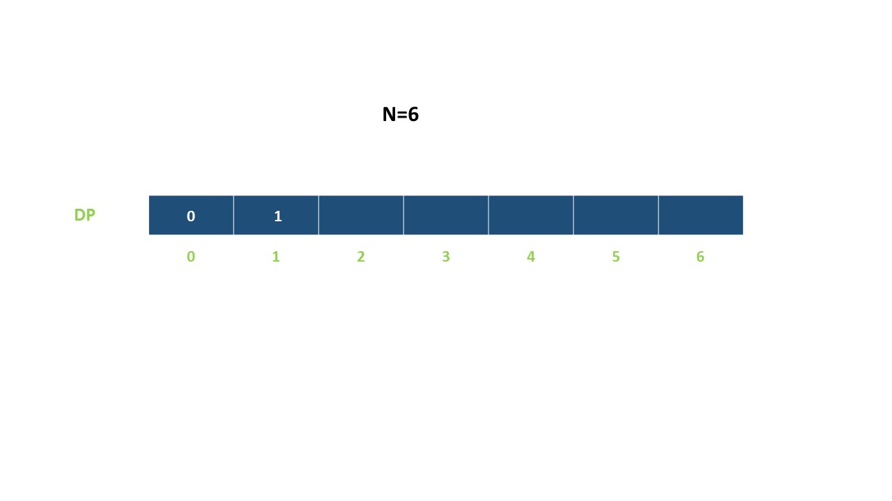

## 爬楼梯
假设有一个n阶楼梯，一步可以走1阶，也可以走2阶，则可以有多少种方法爬完楼梯

假设第i阶，则可以由i-1阶爬一步上来，也可以由i-2阶爬两步上来，假设爬到i-1阶有x种方法，爬到i-2阶有y种方法，则爬到第i阶的方法则为x+y。

```java
public static int climbStairs(int n) {
        if (n == 1) {
            return 1;
        }
        int[] dp = new int[n + 1];
        dp[1] = 1;
        dp[2] = 2;
        for (int i = 3; i <= n; i++) {
            dp[i] = dp[i - 1] + dp[i - 2];
        }
        return dp[n];
    }


```
