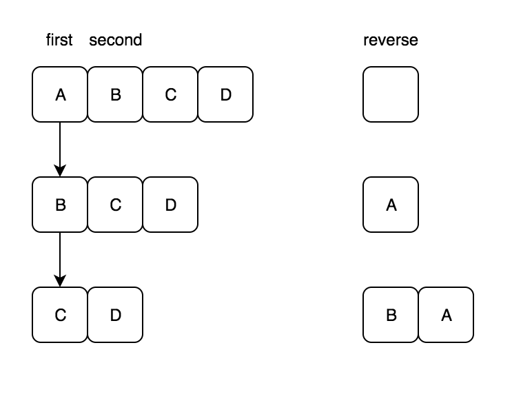

## 单链表反转

```java
public void reverse(Node node){
   Node first=node;
   Node reverse=null;
   while(first !=null){
       Node second=first.next;
       first.next=reverse;
       reverse=first;
       first=second;
   }  
   return reverse;    
}
```